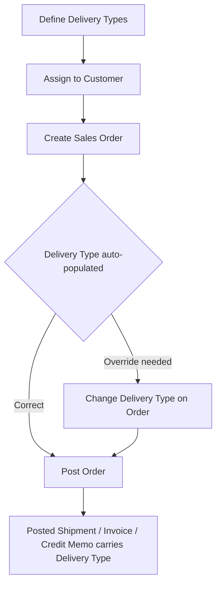
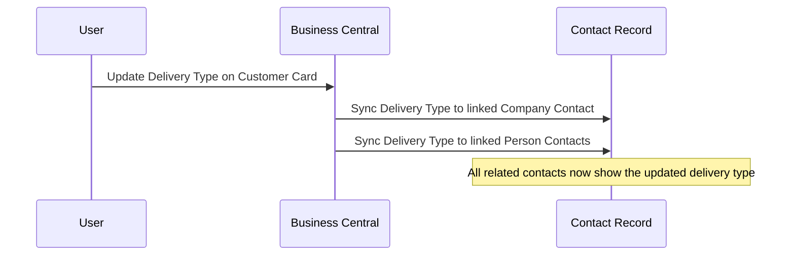

# Delivery Type — User Guide

## What This Extension Does

The Delivery Type extension allows you to categorise customers and sales orders by how goods are delivered. Each delivery type carries settings that control document printing behaviour and integration with external routing systems (WinRoute, Microlise, SwiftCloud).

When a delivery type is assigned to a customer, it automatically flows through to sales orders, posted shipments, invoices, and credit memos — giving warehouse, logistics, and finance teams a consistent view of the delivery method across the entire order-to-cash process. The delivery type also synchronises between customers and their linked contacts, keeping CRM records in step.

---

## Setup

### 1. Define delivery types

1. Use the search icon and search for **Delivery Type**.
2. On the **Delivery Type** list page, create a new line for each delivery method your organisation uses.
3. Complete the fields described below for each entry.

| Field | Description |
|-------|-------------|
| Code | A short unique identifier for the delivery method (e.g. DIRECT, W/SALE, CARRIER, EXPORT). |
| Description | A plain-language name shown on documents and lists. |
| No. of Desp. Notes to Print | How many despatch note copies are printed when shipping with this method. |
| No. of Invoices to Print | How many invoice copies are printed for orders using this method. |
| Direct | Tick if this represents a direct delivery to the end customer. |
| Wholesale | Tick if this represents a wholesale delivery. |
| Carrier | Tick if goods are dispatched via a third-party carrier. |
| Export | Tick if this is an international/export delivery. |
| Export to WinRoute | Tick to include shipments of this type in the WinRoute routing export. |
| Batch - Print to PDF | Tick if batch-printed documents for this type should be saved as PDF rather than sent to a printer. |
| Exclude from SwiftCloud Export | Tick to prevent shipments of this type from being exported to SwiftCloud. |
| Export to Microlise | Tick to include shipments of this type in the Microlise integration export. |

### 2. Assign a delivery type to a customer

1. Search for **Customers** and open the relevant customer card.
2. On the **General** FastTab, set the **Delivery Type** field to the appropriate code.
3. If a **Territory Code** is not entered and the delivery type is neither W/SALE nor EXPORT, the system will warn that the customer will be blocked until a territory code is provided.

### 3. Assign the permission set

Ensure users who need to create or modify delivery types have the **DeliveryType** permission set assigned to their user account.

---

## How to Use

### To create a sales order with the correct delivery type

1. Search for **Sales Orders** and create a new order.
2. Select the customer in the **Sell-to Customer No.** field.
3. The **Delivery Type** field (located after the Shipping Advice field) is automatically populated from the customer card.
4. If a different delivery method is needed for this specific order, change the value manually.

### To check the delivery type on a posted document

1. Open any of the following posted document lists:
   - **Posted Sales Shipments**
   - **Posted Sales Invoices**
   - **Posted Sales Credit Memos**
2. The **Delivery Type** column is visible in the list and on the individual document card, confirming how the order was shipped.

### To view delivery type on tasks

1. Search for **Tasks** (CRM task list).
2. The **Delivery Type** column shows the delivery type associated with the task's linked contact, helping you prioritise follow-ups by delivery channel.

---

## Process Diagrams

### Order flow — delivery type inheritance

### Customer–Contact synchronisation

---

## Fields and Pages

### Delivery Type list

**Navigation:** Search → Delivery Type

| Field | Description |
|-------|-------------|
| Code | Unique identifier for the delivery method. |
| Description | Descriptive name of the delivery method. |
| No. of Desp. Notes to Print | Number of despatch note copies to print. |
| No. of Invoices to Print | Number of invoice copies to print. |
| Direct | Indicates a direct-to-customer delivery. |
| Wholesale | Indicates a wholesale delivery. |
| Carrier | Indicates delivery via third-party carrier. |
| Export | Indicates an international shipment. |
| Export to WinRoute | Flags this type for WinRoute routing export. |
| Batch - Print to PDF | Documents batch-print as PDF instead of paper. |
| Exclude from SwiftCloud Export | Prevents export to SwiftCloud. |
| Export to Microlise | Flags this type for Microlise integration. |

### Customer Card (General FastTab)

**Navigation:** Search → Customers → open card

| Field | Description |
|-------|-------------|
| Delivery Type | The default delivery method for this customer. Flows to new sales orders automatically. |
| Territory Code | Geographic territory code. Required for delivery types other than W/SALE and EXPORT; if missing, the customer may be blocked. |

### Customer List

**Navigation:** Search → Customers

| Field | Description |
|-------|-------------|
| Delivery Type | Shows each customer's assigned delivery method directly in the list for quick reference. |

### Sales Order / Sales Order List

**Navigation:** Search → Sales Orders

| Field | Description |
|-------|-------------|
| Delivery Type | The delivery method for this order. Defaults from the customer but can be overridden. |

### Posted Sales Shipment

**Navigation:** Search → Posted Sales Shipments → open document

| Field | Description |
|-------|-------------|
| Delivery Type | The delivery method recorded at the time of shipment. |

### Posted Sales Invoice / Posted Sales Invoices list

**Navigation:** Search → Posted Sales Invoices

| Field | Description |
|-------|-------------|
| Delivery Type | The delivery method recorded on the invoice. |

### Posted Sales Credit Memo / Posted Sales Credit Memos list

**Navigation:** Search → Posted Sales Credit Memos

| Field | Description |
|-------|-------------|
| Delivery Type | The delivery method recorded on the credit memo. |

### Task List

**Navigation:** Search → Tasks

| Field | Description |
|-------|-------------|
| Delivery Type | The delivery type of the contact linked to the task (read-only, pulled from the contact record). |

---

## FAQ / Troubleshooting

**Why was my customer automatically blocked?**
If you close the Customer Card without entering a Territory Code and the Delivery Type is not W/SALE or EXPORT, the system blocks the customer. To resolve this, reopen the customer card, enter a valid Territory Code, and change the Blocked field back to blank.

**Why doesn't the Delivery Type appear on my sales order?**
The field is populated automatically when you enter the Sell-to Customer No. If the customer does not have a Delivery Type assigned on their card, the field will be blank. Assign a delivery type on the customer card first.

**What happens when I change a customer's delivery type?**
The new delivery type is synchronised to the customer's linked company contact and all related person contacts. Existing posted documents retain the delivery type that was active at the time of posting.

**Why is the Delivery Type on the Task List read-only?**
The task inherits its delivery type from the linked contact record. To change it, update the delivery type on the customer or contact directly.

---

## Glossary

| Term | Meaning |
|------|---------|
| Delivery Type | A classification that defines how goods reach the customer and controls printing/export behaviour. |
| WinRoute | A third-party route-planning system that receives delivery data from Business Central. |
| Microlise | A transport management platform that receives delivery data from Business Central. |
| SwiftCloud | An external system that receives shipment exports; certain delivery types can be excluded. |
| Territory Code | A geographic code assigned to a customer, used for sales territory reporting and route planning. |
