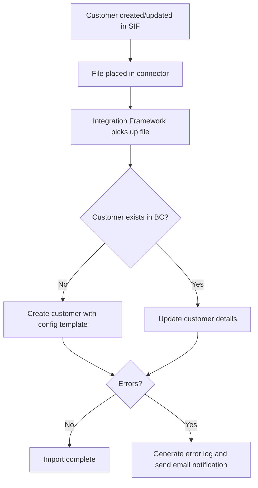
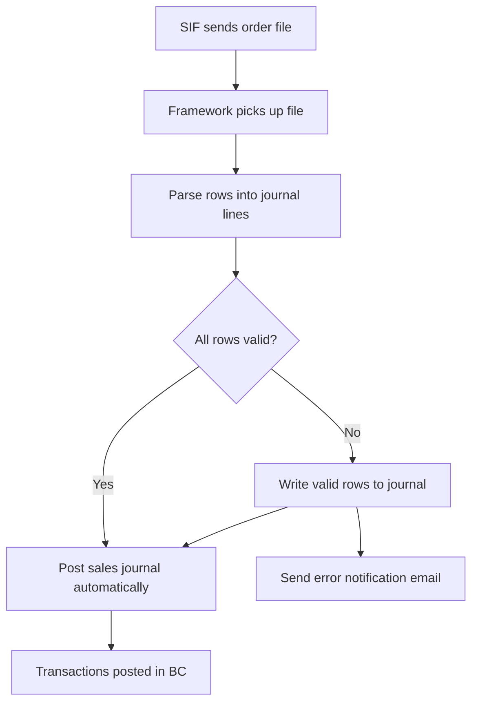
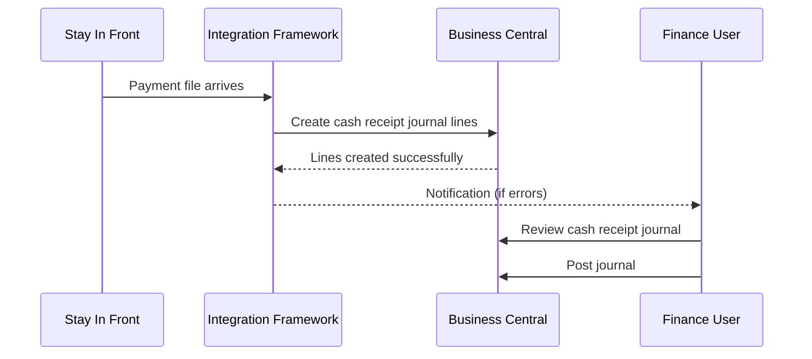
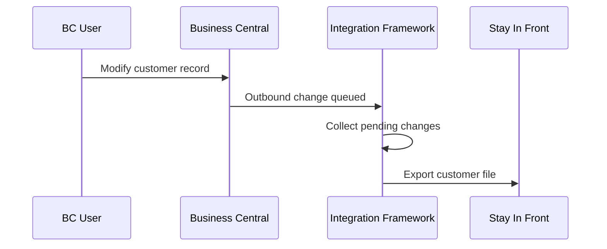

# Stay In Front Integration — User Guide

## What This Extension Does

The Stay In Front (SIF) Integration connects Business Central with the Stay In Front field sales application. It automates the two-way exchange of customer and financial data between the two systems, removing the need for manual re-keying and ensuring that both systems stay in sync.

**Business problems solved:**

- Field sales representatives working in SIF need up-to-date customer records and outstanding balance information from Business Central.
- Orders and payments captured in SIF need to flow back into Business Central for invoicing and cash management.
- New customers created in SIF must appear in Business Central with correct configuration templates applied.

The extension handles:

- **Exporting** customer master data, customer ledger entries, and payment application details from Business Central to SIF.
- **Importing** new/updated customers, sales transactions (orders/credit memos), and payment receipts from SIF into Business Central.
- **Error handling** with detailed error log files attached to notification emails when import records cannot be processed.

---

## Setup

### Prerequisites

- The **Tecman X-Integration Framework Core** extension must be installed and configured with an active connector for the SIF connection.
- The **Delivery Type** extension must be installed.
- A user must be assigned the **SIF Integration** permission set.

### Configure the SIF Integration Setup

1. Open the search bar and search for **SIF Integration Setup**.
2. The setup page opens automatically — there is only one record.
3. Complete the following fields:

| Field | Description |
|-------|-------------|
| Customer Config Template | The configuration template applied to new customers imported from SIF. Select a template linked to the Customer table. |
| Sales Journal Template | The general journal template used when importing SIF sales transactions (orders and credit memos). Must be a Sales Journal type. |
| Sales Journal Batch | The journal batch within the Sales Journal Template where imported transactions are created. |
| Cash Journal Template | The general journal template used when importing SIF payment receipts. Must be a Cash Receipt Journal type. |
| Default Cash Journal Template | The default journal batch used for payments when no territory or payment type is specified in the import file. |
| Sales Journal G/L Account | The balancing G/L account used on imported sales transaction journal lines. Must allow direct posting. |
| Notification Sender E-Mail | The email address shown as the sender on error notification emails dispatched when imports fail. |

4. Close the page — the record saves automatically.

### Configure the Integration Framework

The SIF interfaces must be registered within the X-Integration Framework. Ensure the following interfaces are set up against the appropriate connector and entity:

- **Export Customers** — exports customer master data changes.
- **Export Customer Ledger Entries** — exports invoice/credit memo ledger entries.
- **Export Customer Payment Ledger Entries** — exports payment application details.
- **Import Customer** — imports new and updated customer records.
- **Import SIF Payments** — imports payment receipt files into cash receipt journals.
- **Import SIF Transactions** — imports order and credit memo files into sales journals and posts them automatically.

Refer to the X-Integration Framework documentation for detailed connector and entity configuration.

### Assign Permissions

1. Navigate to **Users → User Card → Permission Sets**.
2. Add the **SIF Integration** permission set to each user who needs to run or monitor the integration.

---

## How to Use

### To export customer balances manually

1. Search for **SIF Integration Setup**.
2. Select the **Export Customer Balance** action in the action bar.
3. Apply filters as needed (customer number, delivery type, or direct customer flag).
4. Choose **OK** to generate the export file.

The export produces a pipe-delimited file containing open ledger entry details for each selected customer, including document type, account number, payment reference, dates, amounts, and invoice identifiers.

### To import customers from SIF

Customer imports are triggered automatically by the X-Integration Framework when a file arrives at the configured connector. The process:

1. The framework picks up the inbound customer file.
2. Each row is validated (account number, store name, and post code are mandatory).
3. **New customers** are created with the configuration template applied from the setup.
4. **Existing customers** are updated with the latest name, address, phone, payment terms, store details, and credit limit.
5. If errors occur, an error log is generated and attached to the notification email.

### To import sales transactions from SIF

1. The framework picks up the inbound order/credit memo file.
2. Each row is parsed into journal lines in the configured Sales Journal.
3. Negative amounts are automatically treated as credit memos; positive amounts as invoices.
4. The journal is posted automatically after all lines are written.
5. If any rows fail validation, an error log is dispatched via email.

### To import payments from SIF

1. The framework picks up the inbound payment file.
2. Each payment line is written to the Cash Receipt Journal, using the territory or payment type from the file to determine the correct journal batch.
3. If a customer has a bill-to customer configured, the payment is applied to the bill-to customer instead.
4. Journal lines are created but **not** posted automatically — a finance user must review and post the cash receipt journal.

### To monitor integration activity

Use the X-Integration Framework's integration log and queue pages to view:

- Successful and failed file exchanges.
- Error details and notification emails sent.
- Pending outbound changes waiting to be exported.

---

## Process Diagrams

### Customer Data Synchronisation

### Sales Transaction Import

### Payment Import Flow

### Customer Export Flow

---

## Fields and Pages

### SIF Integration Setup

**Navigation:** Search → *SIF Integration Setup*

| Field | Description |
|-------|-------------|
| Customer Config Template | Controls which defaults (posting groups, payment terms, etc.) are applied to new customers created via the import. |
| Sales Journal Template | Identifies which journal template receives imported sales transactions. |
| Sales Journal Batch | The specific batch within the sales journal template. |
| Cash Journal Template | Identifies which journal template receives imported payment lines. |
| Default Cash Journal Template | Fallback batch used when the payment file does not specify a territory or payment type. |
| Sales Journal G/L Account | The G/L account used to balance imported sales journal entries. |
| Notification Sender E-Mail | The "from" address on error notification emails. |

### Customer Card (extended fields)

**Navigation:** Search → *Customers* → open a customer card

| Field | Description |
|-------|-------------|
| Store ID | The unique store identifier assigned in the SIF system. |
| Store Name | The store's trading name as held in SIF. |
| Wholesaler | The wholesaler code associated with this customer in SIF. |
| Distribution Centre | The distribution centre code serving this customer. |
| Price List | The price list code assigned to this customer in SIF. |
| Sync. with SIF | Indicates whether this customer's changes are synchronised to SIF. |

### Customer Ledger Entry (extended field)

| Field | Description |
|-------|-------------|
| Sync. with SIF | Indicates whether this ledger entry has been exported to SIF. |

### Detailed Customer Ledger Entry (extended fields)

| Field | Description |
|-------|-------------|
| Sync. with SIF | Indicates whether this detailed entry has been exported to SIF. |
| Posting Source | Shows whether the entry originated from Business Central (NAV) or from SIF. |
| SIF Payment Ref | The payment reference number from the SIF system. |

---

## FAQ / Troubleshooting

### Why did I receive an error notification email after a customer import?

One or more rows in the import file failed validation. The attached error log lists each problem. Common causes:

- Missing account number, store name, or post code in the file.
- A credit limit value that cannot be converted to a number.

Fix the source data in SIF and re-send the file.

### What happens when a customer in the import file already exists in Business Central?

The existing customer record is updated with the latest details from the file (name, address, phone, payment terms, store fields, credit limit, bill-to customer, and email). No duplicate is created.

### Why are payments not posted automatically?

By design, payment imports create journal lines but do not post them. This allows the finance team to review amounts and allocations before committing. Sales transactions (orders/credit memos) are posted automatically.

### What happens when the bill-to customer number differs from the account number?

If a customer has a bill-to customer configured, payments and transactions are redirected to the bill-to customer. This ensures that financial entries appear against the correct billing entity.

### Why does the Posting Source field show "SIF" on some entries?

Transactions imported from the SIF system are stamped with a posting source of **SIF**. Entries created natively in Business Central show **NAV**. This distinction prevents payment entries that originated in SIF from being exported back to SIF, avoiding duplication.

### What does "Allow Partial Import" do?

When enabled on an interface, the system commits each successfully processed record individually. If a later record fails, the previously imported records are retained rather than the entire import being rolled back.

---

## Glossary

| Term | Meaning |
|------|---------|
| SIF | Stay In Front — a field sales and CRM application used by sales representatives. |
| Connector | A communication channel configured in the X-Integration Framework (e.g. SFTP folder, API endpoint). |
| Entity / Interface | Configuration records in the X-Integration Framework that define what data is exchanged and how. |
| Posting Source | A flag on financial entries indicating whether they were created in Business Central (NAV) or imported from SIF. |
| Config Template | A Business Central configuration template that pre-fills default values on newly created records. |
| Direct Customer | A customer classification indicating the customer is served directly rather than through a wholesaler. |
